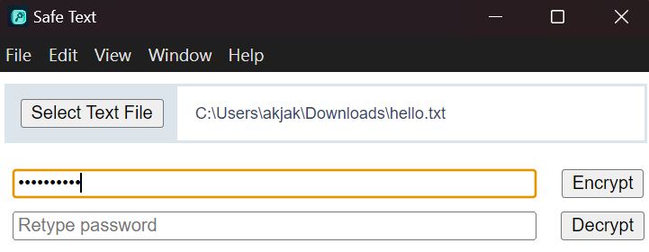

# Safe Text

This Electron-based application enables users to encrypt and decrypt text files using a password. The encrypted and decrypted files are saved in the same directory as the original file. This tool can be particularly useful for securely encrypting your blockchain seed phrases if you insist to store them digitally :rofl: (sure you can run this app offline)

<p align="center">
  
</p>

## Features

- Open and read text files.
- Encrypt text files using AES-256-CBC encryption.
- Decrypt text files encrypted by the app.
- The encrypted file is saved with a `_enc` suffix.
- The decrypted file is saved with a `_dec` suffix.
- Simple user interface for selecting files, entering passwords, and performing encryption/decryption.


## Installation 

To clone and run this repository you'll need [Git](https://git-scm.com) and [Node.js](https://nodejs.org/en/download/) (which comes with [npm](http://npmjs.com)) installed on your computer. From your command line:

```bash
# Install dependencies
npm install
# Run the app
npm start
```

TO create an app (Mac), one can use Electron Packager to complete this:
```bash
# Install Electron Packager 
npm install electron-packager --save-dev
# Run the app
npx electron-packager . safe-text --platform=darwin --universal --icon=../media/safe-text.icns --out=dist --overwrite
```

## Usage

1. Open a File: Click the "Select Text File" button to select a text file. The file path will be displayed in the application.
2. Enter a Password: Input a password in the provided field. This password will be used for encryption and decryption.
3. Encrypt a File: Click the "Encrypt" button to encrypt the selected file. The encrypted file will be saved with a _enc suffix.
4. Decrypt a File: Click the "Decrypt" button to decrypt the selected file. The decrypted file will be saved with a _dec suffix.

## License

[CC0 1.0 (Public Domain)](LICENSE.md)
